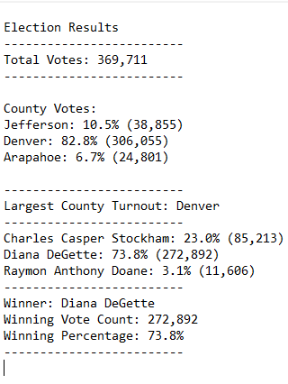

# PyPoll with Python

## Overview of Election Audit
The purpose of this election audit is to determine the results of a U.S. Congressional race.  Not only will the winner be reported, but also total votes and total vote percentages by each candidate and county, and the county with the highest vote turnout.  While this kind of analysis can generally be done using simple Excel tools, another purpose of the audit is to develop an audit analysis program that can be used for any election.

## Election Audit Results
* Total votes cast in this congressional election:  
  * 369,711
* Number of votes and the percentage of total votes for each county:
  *   Jefferson: 10.5% (38,855)
  *   Denver: 82.8% (306,055)
  *   Arapahoe: 6.7% (24,801)
* County with the largest number of votes:
  * Denver   
* Number of votes and the percentage of the total votes for each candidate: 
  * Charles Casper Stockham: 23.0% (85,213)
  * Diana DeGette: 73.8% (272,892)
  * Raymon Anthony Doane: 3.1% (11,606)
*  Which candidate won the election, what was their vote count, and what was their percentage of the total votes?
    * Winner: Diana DeGette
    * Winning Vote Count: 272,892
    * Winning Percentage: 73.8%

## Election Audit Summary
Through appropriate creation and assignment of variables, lists, and dictionaries, the code can be easily used for any election using any election data.  Of course, data file input and output references to start should be changed to the appropriate data file.  

***

For example, a data file may be called "election_data.csv".  In that case, one of the first lines of code would be changed from  

**file_to_load = os.path.join("Resources", "election_results.csv")**

to 

**file_to_load = os.path.join("Resources", "election_data.csv")**

***

Variables should be updated to accurately reflect data found in another election data file as well.  For example, if we were analyzing the results of a presidential election, instead of variables "largest_county" should be changed to "largest_state".

**largest_county = ""**

would change to

**largest_state = ""**

***

Finally, depending on how different data is organized, changes may need to be made to where the script "looks for" candidate name values and county name values.  For example:

**candidate_name = row[2]**
**county_name = row[1]**

may need to be updated to something closer to:

**candidate_name = row[2]**
**state_name = row[3]**

***

Regardless, there are minimal changes required to utilize this script to analyze any election data.

